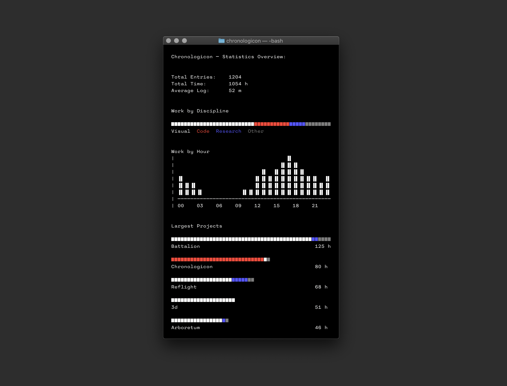

# Chronologicon
v4.63 — 181103

A minimal time tracker, now rewritten for the command line. Chronologicon records your work sessions and displays graphs based on your projects.

Install:
`$ pip install chronologicon`

&nbsp;





## Logs
Chronologicon stores work sessions as *logs.* Each log has a named *discipline* and *project,* along with an optional note. The project should be self-explanatory; the discipline refers to the general type of work. I separate mine into *visual, code,* and *research*, but you should use whichever categories feel most suited to your workflow.

The note is optional, but may be useful to you for recording the specific task you're working on.

A list of all logs is saved in `logs.json`, in Chronologicon's save directory. This file can (and should) be backed up with the `$ chron -b` command.

`stat.json` contains a more lightweight summary of these log data, which is used to display the graphs. It's overwritten every time you complete a log.


## Commands
`$ chron` with no arguments will run preflight checks. This will create any mission-critical files which are currently missing. If everything is OK, it returns nothing.

```
-s <args>   Start a new log timer
-x          Complete the current log
-v <args>   View stats & graphs
-b          Backup the log data file
-d <dir>    Change the save directory
--cancel    Abort the current entry
```

The first time you use Chronologicon, you'll need to specify a save directory with the `-d` argument.


## Usage

`$ chron -d ~/Documents/Chron` Change the save directory to a folder on your computer.

`$ chron -s 'discipline' 'project' 'note'`
Create a new log with discipline, project, and (optionally) a note.

`$ chron -x`
Stop tracking and save the current log.


## Combinations

Because the commands Chronologicon takes are all technically optional arguments, you can use them in combination with each other:

`$ chron -x -s <args>` will stop the current log and start a new one with the specified discipline and project.

`$ chron -x -v` will stop the current log and then display statistics.

I haven't tested every combination, so use them at your own risk (and make regular backups!)


## Extra

`$ chron -v verbose` will return additional projects (every project with a graph width of 1 character or more).

`$ chron -v uniform` will make all project graphs full-width.

Using `uniform` and `verbose` in combination will display all projects.

The `stats.json` file is used for displaying graphs, but it's only updated when a new log is completed. To force an update to this file, you can use `$ chron -v refresh`.

Chron stores in-progress logs in a temporary file in its install directory, meaning you can safely exit all terminal windows, restart your computer, and install updates while logging. I don't recommend relying on this feature, but I hope it can provide some peace of mind.

— R